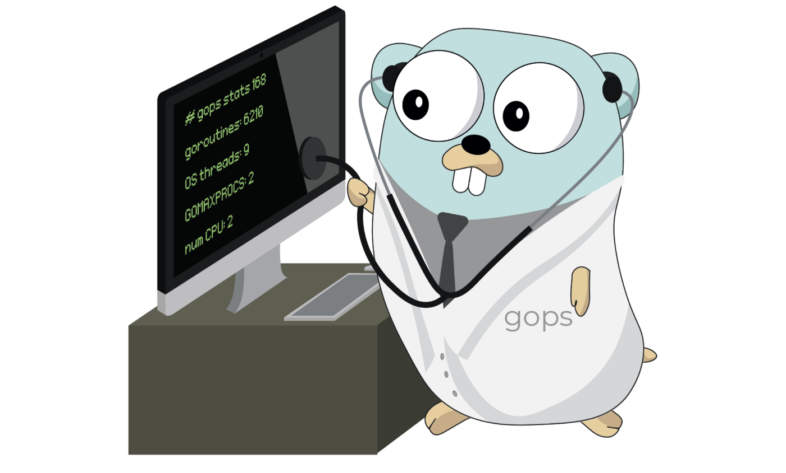

## Данный репозиторий содержит файлы тестового задания уровня L0  

<p align="center">
    
</p>

### 📋 Описание проекта  

В целом проект может служить примером комплексной системы для централизованного управления данными о заказах и представляет собой **микросервисную архитектуру** для обработки заказов с использованием:
- **Apache Kafka** для асинхронной обработки сообщений
- **PostgreSQL** для хранения данных
- **Docker** для контейнеризации компонентов

### Функционал:
- 🖥️ Веб-интерфейс для CRUD-операций
- ⚡ Продюсер для генерации тестовых сообщений
- 🔄 Консумер для обработки и валидации данных

### 🗂️ Структура проекта  

```bash
.
├── kafka/              # Docker compose файл для старта брокера сообщений
├── producer/           # файлы запуска продюсера для направления сообщений брокеру сообщений
├── service/            # файлы веб-интерфейса, сервера и консумера
└── README.md           # этот файл
```

### 🚀 Быстрый старт

**Предварительные требования:**
- Docker Desktop 4.44.3
- Свободные порты: 9092 (Kafka), 8081 (Web), 5432 (PostgreSQL)

🐳 **Docker-образы**    
    confluentinc/cp-zookeeper 7.9.0  
    confluentinc/cp-kafka 7.9.0  
    postgres latest  

**Запуск системы:**  
    - Запустите Kafka-брокер: cd kafka && docker compose up  
    - Активируйте продюсер: cd ../producer && docker compose up  
    - Запустите веб-сервис: cd ../service && docker compose up  
  - После успешного запуска откройте в браузере: http://localhost:8081  

**Подробнее:**
       Запуск рекомендуется выполнять с использованием Docker Desktop.  
       При запуске используются следующие образы: confluentinc/cp-zookeeper v.7.9.0, confluentinc/cp-kafka v.7.9.0, postgres:latest.  
      - Убедитесь в том, что порт 9092 хоста не занят и из директории /kafka запустите брокер сообщений командой "docker compose up". Дождитесь полного запуска.  
      - Из директории /producer запустите командой "docker compose up" продюсер. Продюсер направит несколько тестовых сообщений в брокер и контейнер, имитирующий поступление сообщений остановится. Предусмотрено автосоздание топика "my-topic-L0" для приёма сообщений в брокере.  
      - Убедитесь в том, что порт 8081 хоста не занят и из директории /service запустите командой "docker compose up" само веб-приложение.  

    Если запуск прошёл успешно, по адресу http://localhost:8081 объявится интуитивно понятный интерфейс для работы с данными заказов.  

### ⚙️ Конфигурация

Файл настроек **.env** в директории **/service** используется для некоторого удобства работы:
# Database
    DBL0_USER=postgres - имя пользователя базы данных 
    DBL0_PASSWORD=postgres - пароль от базы данных 
    DBL0_NAME=level-zero-db - имя базы данных  
    DBL0_PORT=5432 - порт базы данных  
# Web
    L0_PORT=8081 - порт хоста для работы веб-приложения.  

### 🧪 Тестирование

    cd service/tests && go test -v

    Вы можете провести тесты работы сервера и базы данных командой "go test" в директории /service/tests/.  